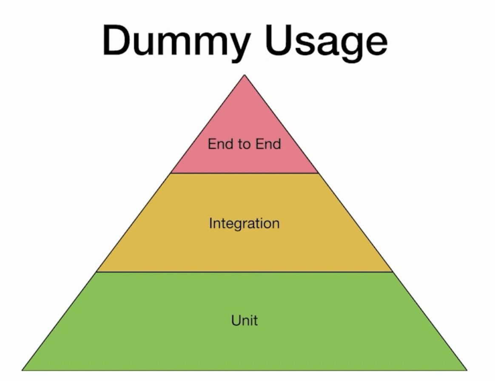
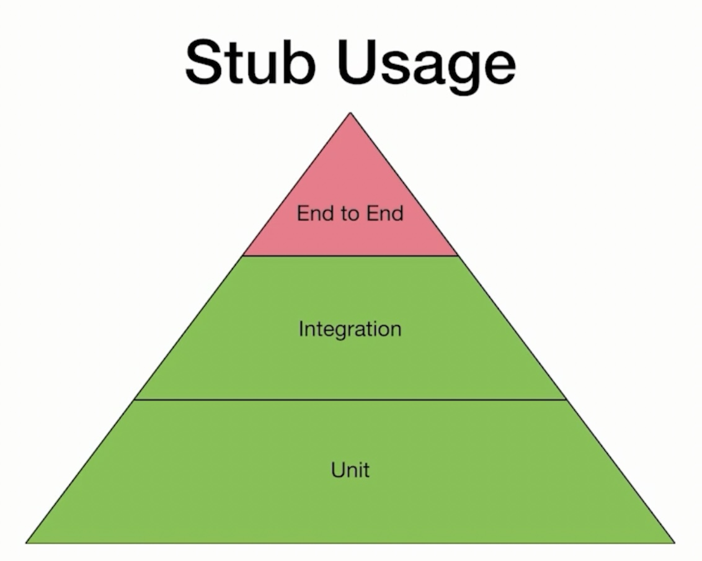
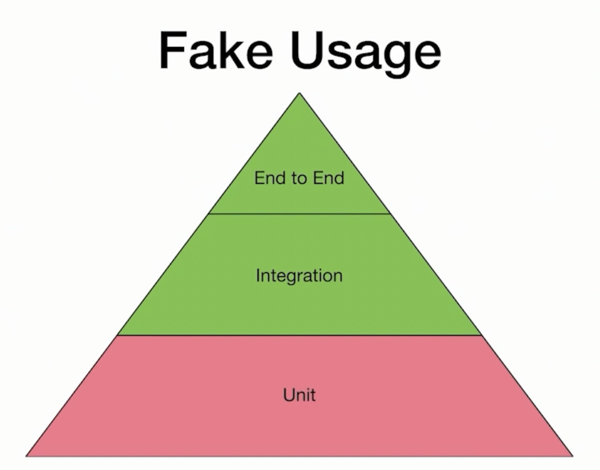
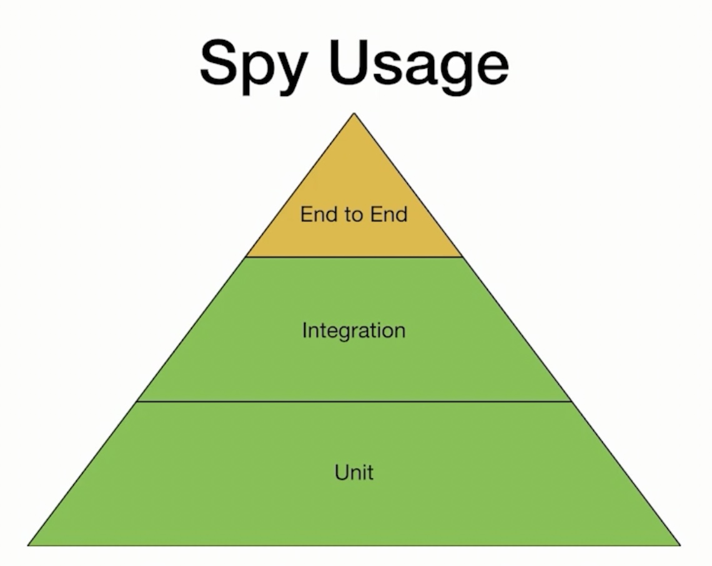
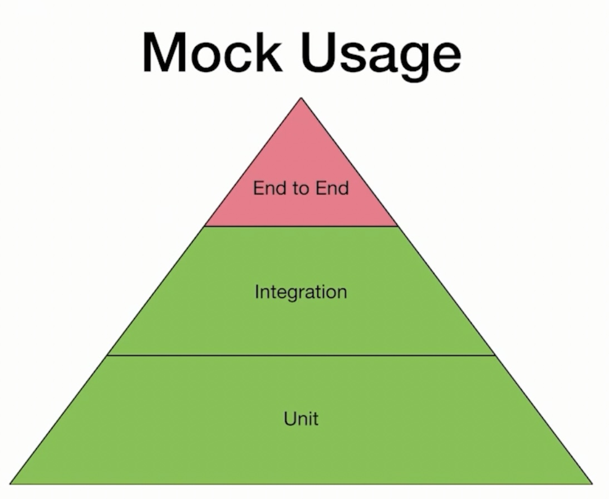

# Unit Testing Terminology

# Table Of Contents

1. [Different Types of Test Doubles](#test_doubles)
    1. [Dummy](#dummy)
    1. [Stub](#stub)
    1. [Fake](#fake)
    1. [Spy](#spy)
    1. [Mock](#mock)
1. [References](#references)

# Different Types of Test Doubles <a name="test_doubles"></a>

- The classification of Mocks, Fakes, and Stubs can be inconsistent across various sources.
- Adding to the complexity, the term 'Mock' is often used colloquially for various types of test doubles.
- Moreover, it's not uncommon for some doubles to fulfill multiple roles, acting as both Mocks and Stubs simultaneously.

We can categorize the five types of doubles as follows:
- Those that don’t simulate behavior or observe interactions: Dummies.
- Those that simulate behavior: Stubs and Fakes.
- Those that observe interactions: Mocks and Spies.
- Those that don't have a functional implementation under the hood: Dummies, Stubs, and Mocks.
- Those that have a functional implementation under the hoods: Fakes and Spies.

## Dummy <a name="dummy"></a>

- Its purpose is to "satisfy a signature".
- Usually, this as a placeholder for an input parameter of the system under test.
    - It doesn't do anything. No interactions are performed on it.
    - It doesn't affect the behaviour you are testing.
- Dummy can be something as simple as passing `nil` or a void implementation with exceptions to ensure it's never leveraged.

```swift
protocol Repository {
    func save(data: SomeData)
}

struct DummyRepository: Repository {
    func save(data: SomeData) {
        // Does nothing
    }
}
```


## Stub <a name="stub"></a>

- **Stubs** are objects that **return predefined values**:
    - Functions return hard-coded values. It always returns the same output regardless of the input.
    - Void functions are empty.
    - Dynamic stubbed behaviour: we set an object property, and then, when we call the tested function, it returns that property as a result.
- They don't have working implementations.
- Examples: 
    - A Stub that always return the same value when called with any arguments.
    - A Stub that always throw same error when the function is called.



## Fake <a name="fake"></a>

- **Fakes** are objects with **simplified, lightweight and concrete implementation**.
- It eliminates heavyweight dependencies.
- It should be used sparingly and only in cases where a Stub or Mock is not usable.
- Example: using in-memory storage as a replacement for database storage.



## Spy <a name="spy"></a>

- Spies are usually objects with a single responsibility of **capturing the received messages/functions**.
    - Spies have some recording capability: they save invoked messages.
- Spies can help us verify:
    - What functions were called.
    - How many times the function was invoked, with which parameters and in which order.
- We should use Spies where we don't care about the return values of functions.



```swift
final class HTTPClientSpy: HTTPClient {
    private var messages = [(url: URL, completion: (Error) -> Void)]()

    var requestedURLs: [URL] {
    	return messages.map { $0.url }
    }

    func get(from url: URL, completion: @escaping (Error) -> Void) {
    	messages.append((url, completion))
    }

    func complete(with error: Error, at index: Int = 0) {
    	messages[index].completion(error)
    }
}
```

## Mock <a name="mock"></a>

- **Mocks** are objects that **have predefined behavior and expectations.**.
    - Can act as Stubs, but the behavior of a Mock can be changed dynamically (can return dynamic value).
    - Can also act a Spy as it, for example, allows us to verify that a method was called.
- Mocks are generally used to test the behavior of our code rather than its output.
    -  We can use mocks to verify that our code is calling the dependencies in an expected way.
- Unlike Fakes, mocks don’t have working implementations.
- Example:
    - A mock object might be programmed to return a specific value when it is called with certain arguments. 




# References <a name="references"></a>

- https://www.youtube.com/watch?v=BNXPRIscfQ8
- https://www.ankursheel.com/blog/difference-stubs-mocks-fakes-spies
- https://mokacoding.com/blog/swift-test-doubles/
- https://proandroiddev.com/the-definitive-guide-to-test-doubles-on-android-part-1-theory-5aa2bffb568c
- https://www.educative.io/answers/what-is-faking-vs-mocking-vs-stubbing
- http://xunitpatterns.com/Test%20Double.html
- https://academy.essentialdeveloper.com/courses/447455/lectures/8644863
